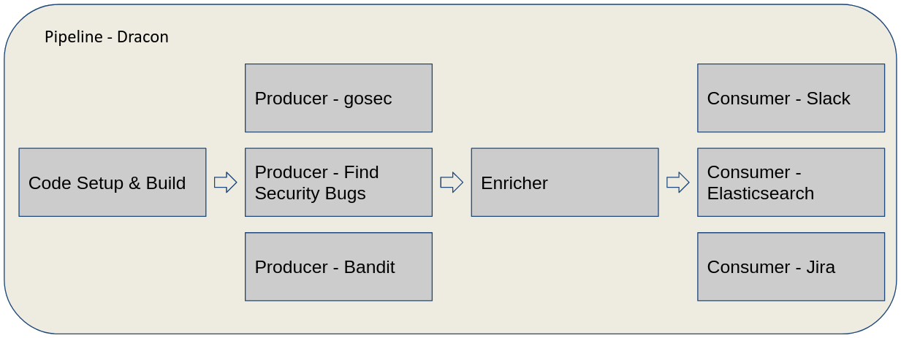

# Dracon

Security pipelines on Kubernetes. The purpose of this project is to provide a
scalable and flexible tool to execute arbitrary tools on arbitrary code while
processing the results in a flexible way.

# Getting Started

The [Getting started in Minikube](docs/getting-started/minikube.md) tutorial
explains how to install, configure, and run Dracon.

Other tutorials are also available:

| Name                                                    | Description                                                |
| ------------------------------------------------------- | ---------------------------------------------------------- |
| [Getting started in Minikube][tut-minikube]             | Beginner guide on how to get started with Dracon           |
| [Running our demo pipeline][tut-running-demos]          | End to end demo of running an example pipeline             |
| [Example of using a public git repo][tut-public-repo]   | Example of running Dracon against a public git repository  |
| [Example of using a private git repo][tut-private-repo] | Example of running Dracon against a private git repository |
| [Creating your own pipeline][tut-own-pipeline]          | WIP: How to create your own custom dracon pipeline         |
| [Creating your own producer][tut-own-producer]          | WIP: Extending Dracon by creating your own custom producer |
| [Creating your own consumer][tut-own-consumer]          | WIP: Extending Dracon by creating your own custom consumer |

## Announcements

Dracon was announced at OWASP Appsec Amsterdam in 2019. Check out [the slides](docs/presentations/Dracon-OWASP-Presentation-export.pdf)
from the presentation.

# Support

If you have questions, reach out to us by opening a new [issue](https://github.com/thought-machine/dracon/issues/new) on Github.

# Development & Contributing

Contributions are welcome, see the [developing](docs/contributers/DEVELOPING.md)
and [releasing](docs/contributers/RELEASES.md) guides on how to get started.

# License

Dracon is under the Apache 2.0 license. See the [LICENSE](LICENSE) file for
details.

[tut-minikube]: docs/getting-started/minikube.md
[tut-own-pipeline]: docs/getting-started/tutorials/constructing-your-own-pipeline.md
[tut-own-consumer]: docs/getting-started/tutorials/creating-your-own-consumer.md
[tut-own-producer]: docs/getting-started/tutorials/creating-your-own-producer.md
[tut-private-repo]: docs/getting-started/tutorials/running-demo-against-private-repository.md
[tut-public-repo]: docs/getting-started/tutorials/running-demo-against-public-repository.md
[tut-running-demos]: docs/getting-started/tutorials/running-demos.md
